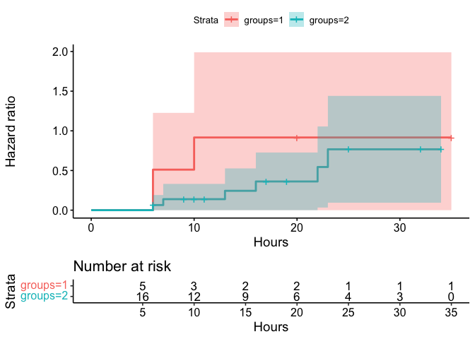

    # install.packages("haven")
    # install.packages("survival")

    library(haven)
    library(survival)
    library(survminer)

### Question 3 - Kaplan Meier plot

    # load the data
    df <- read_sav("Day 1_data set - 61162_mice.sav")

    Surv(df$Time, df$Death)

    ##  [1]  30   50   50+  51   66+  82   92  120+ 140  150  180  190

    fit.KM <- survfit(Surv(Time, Death) ~ 1, data = df)

    ggsurvplot(
        fit = fit.KM, 
        xlab = "Hours", 
        ylab = "Overall survival probability", risk.table = T)

### Question 4 - Estimate the survival and cumulative hazard functions

    df2 <- read_sav("Day 1 - drug6mp.sav")

    min(df2$timerelmp)

    ## [1] 6

    max(df2$timerelmp)

    ## [1] 35

    fit.KM2 <- survfit(Surv(timerelmp, Status) ~ groups, data = df2)

    ggsurvplot(
        fit = fit.KM2, 
        xlab = "Hours", 
        ylab = "Overall survival probability", risk.table = T, conf.int = T)

    summary(fit.KM2)

    ## Call: survfit(formula = Surv(timerelmp, Status) ~ groups, data = df2)
    ## 
    ##                 groups=1 
    ##  time n.risk n.event survival std.err lower 95% CI upper 95% CI
    ##     6      5       2      0.6   0.219        0.293            1
    ##    10      3       1      0.4   0.219        0.137            1
    ## 
    ##                 groups=2 
    ##  time n.risk n.event survival std.err lower 95% CI upper 95% CI
    ##     6     16       1    0.938  0.0605        0.826        1.000
    ##     7     14       1    0.871  0.0856        0.718        1.000
    ##    13     10       1    0.783  0.1129        0.591        1.000
    ##    16      9       1    0.696  0.1297        0.484        1.000
    ##    22      6       1    0.580  0.1513        0.348        0.968
    ##    23      5       1    0.464  0.1595        0.237        0.910

    ggsurvplot(
        fit = fit.KM2, 
        xlab = "Hours", 
        ylab = "Hazard ratio", risk.table = T, conf.int = T, fun = "cumhaz")

