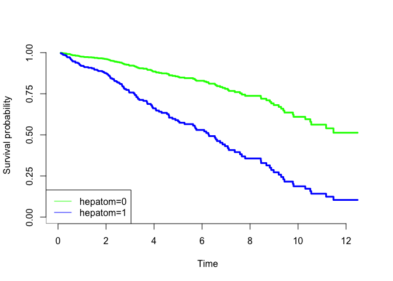
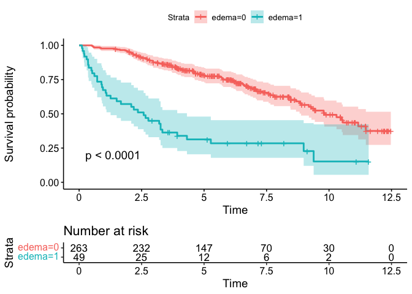
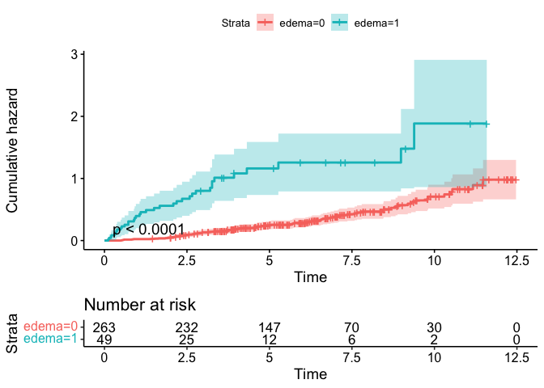
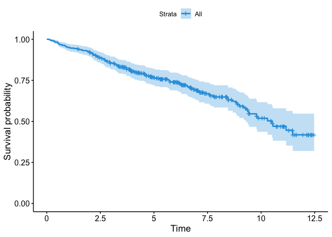
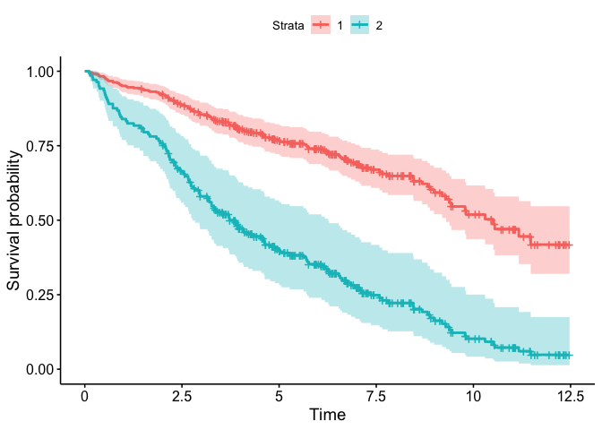

### Fit a Cox model

    library(dplyr)

    ## 
    ## Attaching package: 'dplyr'

    ## The following objects are masked from 'package:stats':
    ## 
    ##     filter, lag

    ## The following objects are masked from 'package:base':
    ## 
    ##     intersect, setdiff, setequal, union

    library(haven)
    library(survival)
    library(survminer)

    ## Loading required package: ggplot2

    ## Loading required package: ggpubr

    ## 
    ## Attaching package: 'survminer'

    ## The following object is masked from 'package:survival':
    ## 
    ##     myeloma

#### 1.

    df <- read_sav("Day 4_pbc.sav")

    fit.dpca.cox <- coxph(Surv(years, status) ~ rx + bilirubin, data = df)

    fit.dpca.cox

    ## Call:
    ## coxph(formula = Surv(years, status) ~ rx + bilirubin, data = df)
    ## 
    ##               coef exp(coef) se(coef)      z      p
    ## rx        -0.20118   0.81776  0.18342 -1.097  0.273
    ## bilirubin  0.15147   1.16354  0.01329 11.400 <2e-16
    ## 
    ## Likelihood ratio test=85.86  on 2 df, p=< 2.2e-16
    ## n= 312, number of events= 125

#### 2.

    fit.dpca.cox.histology <- coxph(Surv(years, status) ~ as.factor(histol), data = df)
    fit.dpca.cox.histology

    ## Call:
    ## coxph(formula = Surv(years, status) ~ as.factor(histol), data = df)
    ## 
    ##                      coef exp(coef) se(coef)     z      p
    ## as.factor(histol)2  1.607     4.988    1.031 1.559 0.1191
    ## as.factor(histol)3  2.150     8.581    1.012 2.124 0.0337
    ## as.factor(histol)4  3.063    21.387    1.009 3.036 0.0024
    ## 
    ## Likelihood ratio test=52.74  on 3 df, p=2.085e-11
    ## n= 312, number of events= 125

#### 3.

    fit.dpca.cox.age <- coxph(Surv(years, status) ~ age, data = df)
    fit.dpca.cox.age

    ## Call:
    ## coxph(formula = Surv(years, status) ~ age, data = df)
    ## 
    ##         coef exp(coef) se(coef)     z        p
    ## age 0.039995  1.040806 0.008811 4.539 5.65e-06
    ## 
    ## Likelihood ratio test=20.51  on 1 df, p=5.947e-06
    ## n= 312, number of events= 125

    # lower CI
    exp(0.039995 - 0.008811 * 1.96)

    ## [1] 1.022986

    # upper CI
    exp(0.039995 + 0.008811 * 1.96)

    ## [1] 1.058936

#### 4.

    fit.dpca.cox.age <- coxph(Surv(years, status) ~ age, data = df)
    fit.dpca.cox.age

    ## Call:
    ## coxph(formula = Surv(years, status) ~ age, data = df)
    ## 
    ##         coef exp(coef) se(coef)     z        p
    ## age 0.039995  1.040806 0.008811 4.539 5.65e-06
    ## 
    ## Likelihood ratio test=20.51  on 1 df, p=5.947e-06
    ## n= 312, number of events= 125

    exp(0.039995) ^ 5

    ## [1] 1.221372

    #lower CI
    exp(0.039995 - 1.96 * 0.008811) ^ 5

    ## [1] 1.120334

    #upper CI
    exp(0.039995+ 1.96 * 0.008811) ^ 5

    ## [1] 1.331522

#### 5.

    fit.dpca.cox.bilirubin <- coxph(Surv(years, status) ~ bilirubin, data = df)
    fit.dpca.cox.bilirubin

    ## Call:
    ## coxph(formula = Surv(years, status) ~ bilirubin, data = df)
    ## 
    ##              coef exp(coef) se(coef)     z      p
    ## bilirubin 0.14892   1.16058  0.01301 11.44 <2e-16
    ## 
    ## Likelihood ratio test=84.65  on 1 df, p=< 2.2e-16
    ## n= 312, number of events= 125

    quantile(df$bilirubin)

    ##     0%    25%    50%    75%   100% 
    ##  0.300  0.800  1.350  3.425 28.000

    fit.dpca.cox.bilirubin2 <- coxph(Surv(years, status) ~ bilirubin + hepatom + spiders + edema, data = df)
    fit.dpca.cox.bilirubin2

    ## Call:
    ## coxph(formula = Surv(years, status) ~ bilirubin + hepatom + spiders + 
    ##     edema, data = df)
    ## 
    ##              coef exp(coef) se(coef)     z        p
    ## bilirubin 0.11186   1.11836  0.01487 7.524 5.31e-14
    ## hepatom   0.71818   2.05070  0.21185 3.390 0.000699
    ## spiders   0.38905   1.47558  0.19475 1.998 0.045754
    ## edema     0.75581   2.12934  0.22215 3.402 0.000668
    ## 
    ## Likelihood ratio test=119  on 4 df, p=< 2.2e-16
    ## n= 312, number of events= 125

### Interaction

#### 1.

    fit.dpca.rxhepa <- coxph(Surv(years, status) ~ rx * hepatom, data = df)
    fit.dpca.rxhepa

    ## Call:
    ## coxph(formula = Surv(years, status) ~ rx * hepatom, data = df)
    ## 
    ##                coef exp(coef) se(coef)      z        p
    ## rx         -0.17856   0.83648  0.33216 -0.538    0.591
    ## hepatom     1.14808   3.15214  0.26591  4.318 1.58e-05
    ## rx:hepatom  0.09501   1.09968  0.39490  0.241    0.810
    ## 
    ## Likelihood ratio test=40.56  on 3 df, p=8.126e-09
    ## n= 312, number of events= 125

#### 2.

No, as p = 0.81

#### 3.

### Predicted survival for specific covariate patterns

#### 1.

    fit.dpca.bilhep <- coxph(Surv(years, status) ~ bilirubin + hepatom, data = df, x = T)
    fit.dpca.bilhep

    ## Call:
    ## coxph(formula = Surv(years, status) ~ bilirubin + hepatom, data = df, 
    ##     x = T)
    ## 
    ##              coef exp(coef) se(coef)     z       p
    ## bilirubin 0.13106   1.14004  0.01381 9.491 < 2e-16
    ## hepatom   0.86193   2.36773  0.20761 4.152 3.3e-05
    ## 
    ## Likelihood ratio test=102.9  on 2 df, p=< 2.2e-16
    ## n= 312, number of events= 125

    head(df[,c("hepatom","bilirubin")])

    ## # A tibble: 6 × 2
    ##     hepatom bilirubin
    ##   <dbl+lbl>     <dbl>
    ## 1   1 [yes]    14.5  
    ## 2   1 [yes]     1.10 
    ## 3   0 [no]      1.40 
    ## 4   1 [yes]     1.80 
    ## 5   1 [yes]     3.40 
    ## 6   1 [yes]     0.800

    df.hepbil <- df %>% group_by(hepatom) %>% summarise(bilirubin = mean(bilirubin))

    library(pec)

    ## Loading required package: prodlim

    plotPredictSurvProb(fit.dpca.bilhep, newdata = df.hepbil, 
                        col = c("green", "blue"), legend = T)
    legend("bottomleft", legend=c("hepatom=0", "hepatom=1"),
           lty=c(1,1),col=c("green", "blue"))

\#\#\#\# 2. No you can’t estimate mean survival looking at these graphs
as these are predictions.

### Stratified Cox Model and test for the proportional hazard assumption

#### 1.

    fit.KM <- survfit(Surv(years, status) ~ edema, data = df)

    ggsurvplot(fit.KM, conf.int = T, pval = T, risk.table = T)

    ggsurvplot(fit.KM, conf.int = T, pval = T, risk.table = T, fun = "cumhaz")

    fit.KM

    ## Call: survfit(formula = Surv(years, status) ~ edema, data = df)
    ## 
    ##           n events median 0.95LCL 0.95UCL
    ## edema=0 263     89   9.81    8.88      NA
    ## edema=1  49     36   2.58    1.26    4.31

Looking at the KM, proportional hazard assumption holds as there is no
crossing point between lines.

#### 2.

    fit.cox.edema <- coxph(Surv(years, status) ~ edema + age, data = df, x = T)
    fit.cox.edema

    ## Call:
    ## coxph(formula = Surv(years, status) ~ edema + age, data = df, 
    ##     x = T)
    ## 
    ##           coef exp(coef) se(coef)     z        p
    ## edema 1.245064  3.473158 0.204544 6.087 1.15e-09
    ## age   0.030403  1.030870 0.008603 3.534 0.000409
    ## 
    ## Likelihood ratio test=51.22  on 2 df, p=7.53e-12
    ## n= 312, number of events= 125

    ggsurvplot(survfit(fit.cox.edema), data = df, palette = c("#2E9FDF"))

    df_new <- with(df, data.frame(edema = c(0,1), age = rep(mean(age, na.rm = TRUE), 2)))

    df_new

    ##   edema      age
    ## 1     0 50.01901
    ## 2     1 50.01901

    fit.new <- survfit(fit.cox.edema, newdata = df_new)
    ggsurvplot(fit.new, data = df_new)

This seems like a better KM plot compared to earlier version.

    fit.cox.edema.strata <- coxph(Surv(years, status) ~ strata(edema) + age, data = df, x = T)
    fit.cox.edema.strata

    ## Call:
    ## coxph(formula = Surv(years, status) ~ strata(edema) + age, data = df, 
    ##     x = T)
    ## 
    ##        coef exp(coef) se(coef)     z       p
    ## age 0.02939   1.02982  0.00866 3.394 0.00069
    ## 
    ## Likelihood ratio test=11.58  on 1 df, p=0.0006679
    ## n= 312, number of events= 125
