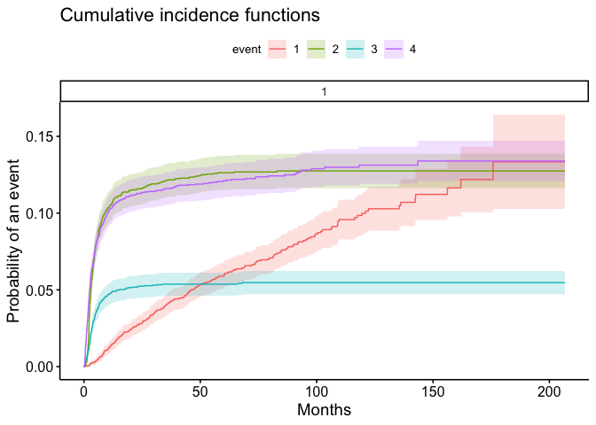
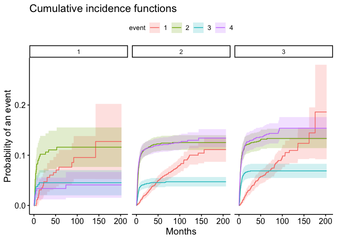
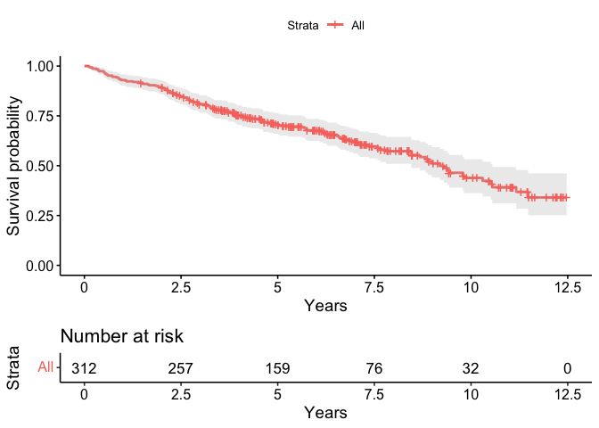
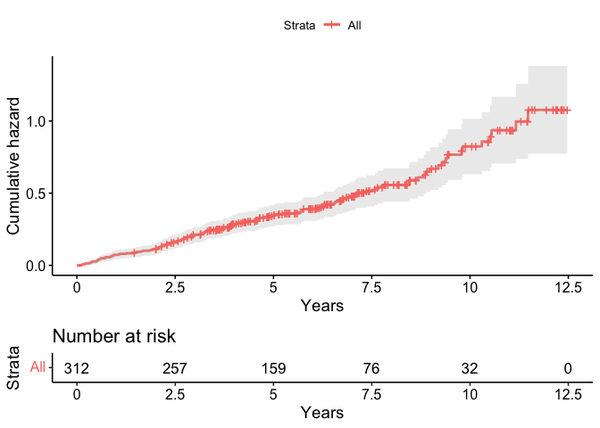

    library(dplyr)

    ## 
    ## Attaching package: 'dplyr'

    ## The following objects are masked from 'package:stats':
    ## 
    ##     filter, lag

    ## The following objects are masked from 'package:base':
    ## 
    ##     intersect, setdiff, setequal, union

    library(haven)
    library(survival)
    library(survminer)

    ## Loading required package: ggplot2

    ## Loading required package: ggpubr

    ## 
    ## Attaching package: 'survminer'

    ## The following object is masked from 'package:survival':
    ## 
    ##     myeloma

#### 1.

    df <- read_sav("Day 5_cod.sav")

cause of death:

    table(df$status)

    ## 
    ##    0    1    2    3    4 
    ## 2271  247  439  190  435

age characteristics:

    table(df$age)

    ## 
    ##    1    2    3 
    ##  270 2051 1261

#### 2.

    library(cmprsk)

    ## Warning: package 'cmprsk' was built under R version 4.1.2

    ci_fit <- 
      cuminc(
        ftime = df$survmon, 
        fstatus = df$status, 
        cencode = 0
        )

    ggcompetingrisks(ci_fit, xlab = "Months", conf.int = T)

    ci_fit.age <- 
      cuminc(
        ftime = df$survmon, 
        fstatus = df$status, 
        group = df$age,
        cencode = 0
        )

    ggcompetingrisks(ci_fit.age, xlab = "Months", conf.int = T, multiple_panels = T)

    ci_fit.age[["Tests"]]

    ##         stat           pv df
    ## 1  2.0080805 3.663961e-01  2
    ## 2  0.9637204 6.176334e-01  2
    ## 3  8.0925857 1.748708e-02  2
    ## 4 21.8800281 1.773423e-05  2

    ci_fit.age$`3 1`$time

    ##   [1]   0.000000   2.399343   2.399343   2.530813   2.530813   3.253903
    ##   [7]   3.253903   4.207067   4.207067   4.502876   4.502876   5.193098
    ##  [13]   5.193098   5.751849   5.751849   7.033689   7.033689   7.625308
    ##  [19]   7.625308   7.789647   7.789647   8.315530   8.315530   8.348398
    ##  [25]   8.348398   9.893180   9.893180  10.386196  10.386196  11.339359
    ##  [31]  11.339359  11.437962  11.437962  11.733772  11.733772  12.062449
    ##  [37]  12.062449  12.752671  12.752671  13.212818  13.212818  13.574363
    ##  [43]  13.574363  14.297453  14.297453  14.626130  14.626130  15.053410
    ##  [49]  15.053410  16.236647  16.236647  16.861134  16.861134  16.894002
    ##  [55]  16.894002  17.025472  17.025472  17.091208  17.091208  18.405916
    ##  [61]  18.405916  19.260477  19.260477  19.654889  19.654889  20.838127
    ##  [67]  20.838127  21.232539  21.232539  25.242399  25.242399  25.308135
    ##  [73]  25.308135  25.702547  25.702547  26.721446  26.721446  26.885785
    ##  [79]  26.885785  27.937551  27.937551  28.134758  28.134758  28.562038
    ##  [85]  28.562038  29.646672  29.646672  30.172555  30.172555  31.125719
    ##  [91]  31.125719  34.708299  34.708299  35.036976  35.036976  35.464256
    ##  [97]  35.464256  36.055875  36.055875  36.088743  36.088743  37.074774
    ## [103]  37.074774  38.126541  38.126541  38.356615  38.356615  39.178307
    ## [109]  39.178307  42.859491  42.859491  44.075596  44.075596  44.141331
    ## [115]  44.141331  45.718981  45.718981  45.817584  45.817584  46.474938
    ## [121]  46.474938  48.709942  48.709942  49.926048  49.926048  54.034511
    ## [127]  54.034511  56.894002  56.894002  60.115037  60.115037  61.594084
    ## [133]  61.594084  62.054232  62.054232  63.763353  63.763353  67.806081
    ## [139]  67.806081  68.824979  68.824979  72.966311  72.966311  73.689400
    ## [145]  73.689400  75.990140  75.990140  81.183237  81.183237  81.479047
    ## [151]  81.479047  82.169269  82.169269  83.023829  83.023829  84.700082
    ## [157]  84.700082  87.756779  87.756779  90.188989  90.188989  97.387017
    ## [163]  97.387017  99.161873  99.161873 100.377979 100.377979 106.294166
    ## [169] 106.294166 106.589975 106.589975 116.318817 116.318817 135.480690
    ## [175] 135.480690 136.138044 136.138044 161.939195 161.939195 175.842235
    ## [181] 175.842235 202.366475

#### 4.

    fit.cox <- coxph(Surv(survmon, ifelse(status == 1, 1, 0)) ~ as.factor(age), data = df)

    fit.cox

    ## Call:
    ## coxph(formula = Surv(survmon, ifelse(status == 1, 1, 0)) ~ as.factor(age), 
    ##     data = df)
    ## 
    ##                     coef exp(coef) se(coef)      z     p
    ## as.factor(age)2 -0.07916   0.92389  0.23474 -0.337 0.736
    ## as.factor(age)3  0.17114   1.18666  0.24202  0.707 0.479
    ## 
    ## Likelihood ratio test=3.35  on 2 df, p=0.187
    ## n= 3582, number of events= 247

Age does not have a significant effect on death because of relapse.

#### 5.

    summary(survfit(Surv(survmon, ifelse(status == 1, 1, 0)) ~ 1, data = df[df$age == 3,])) # 0.913

    ## Call: survfit(formula = Surv(survmon, ifelse(status == 1, 1, 0)) ~ 
    ##     1, data = df[df$age == 3, ])
    ## 
    ##    time n.risk n.event survival  std.err lower 95% CI upper 95% CI
    ##    2.40   1116       1    0.999 0.000896        0.997        1.000
    ##    2.53   1102       1    0.998 0.001274        0.996        1.000
    ##    3.25   1041       1    0.997 0.001593        0.994        1.000
    ##    4.21    998       1    0.996 0.001879        0.993        1.000
    ##    4.50    987       1    0.995 0.002131        0.991        0.999
    ##    5.19    953       1    0.994 0.002371        0.990        0.999
    ##    5.75    940       1    0.993 0.002593        0.988        0.998
    ##    7.03    913       1    0.992 0.002809        0.987        0.998
    ##    7.63    900       1    0.991 0.003015        0.985        0.997
    ##    7.79    897       2    0.989 0.003389        0.982        0.995
    ##    8.32    886       1    0.988 0.003564        0.981        0.995
    ##    8.35    884       1    0.986 0.003731        0.979        0.994
    ##    9.89    861       1    0.985 0.003899        0.978        0.993
    ##   10.39    850       1    0.984 0.004063        0.976        0.992
    ##   11.34    840       1    0.983 0.004223        0.975        0.991
    ##   11.44    838       1    0.982 0.004378        0.973        0.990
    ##   11.73    833       1    0.981 0.004529        0.972        0.990
    ##   12.06    829       1    0.979 0.004675        0.970        0.989
    ##   12.75    818       1    0.978 0.004821        0.969        0.988
    ##   13.21    813       1    0.977 0.004963        0.967        0.987
    ##   13.57    810       1    0.976 0.005101        0.966        0.986
    ##   14.30    801       1    0.975 0.005238        0.964        0.985
    ##   14.63    798       1    0.973 0.005372        0.963        0.984
    ##   15.05    794       1    0.972 0.005503        0.961        0.983
    ##   16.24    783       1    0.971 0.005635        0.960        0.982
    ##   16.86    775       1    0.970 0.005765        0.958        0.981
    ##   16.89    774       1    0.968 0.005892        0.957        0.980
    ##   17.03    771       1    0.967 0.006017        0.955        0.979
    ##   17.09    770       1    0.966 0.006139        0.954        0.978
    ##   18.41    763       1    0.965 0.006260        0.952        0.977
    ##   19.26    759       1    0.963 0.006379        0.951        0.976
    ##   19.65    756       1    0.962 0.006497        0.949        0.975
    ##   20.84    750       2    0.960 0.006728        0.946        0.973
    ##   21.23    746       1    0.958 0.006841        0.945        0.972
    ##   25.24    727       1    0.957 0.006957        0.943        0.971
    ##   25.31    725       1    0.956 0.007072        0.942        0.970
    ##   25.70    724       1    0.954 0.007184        0.940        0.969
    ##   26.72    716       1    0.953 0.007297        0.939        0.967
    ##   26.89    715       1    0.952 0.007407        0.937        0.966
    ##   27.94    709       1    0.950 0.007518        0.936        0.965
    ##   28.13    706       1    0.949 0.007626        0.934        0.964
    ##   28.56    705       1    0.948 0.007734        0.933        0.963
    ##   29.65    698       1    0.946 0.007841        0.931        0.962
    ##   30.17    693       1    0.945 0.007947        0.929        0.961
    ##   31.13    681       1    0.944 0.008056        0.928        0.959
    ##   34.71    666       1    0.942 0.008167        0.926        0.958
    ##   35.04    663       1    0.941 0.008278        0.925        0.957
    ##   35.46    661       1    0.939 0.008387        0.923        0.956
    ##   36.06    654       1    0.938 0.008496        0.921        0.955
    ##   36.09    652       1    0.936 0.008604        0.920        0.953
    ##   37.07    639       1    0.935 0.008714        0.918        0.952
    ##   38.13    633       1    0.933 0.008825        0.916        0.951
    ##   38.36    629       1    0.932 0.008935        0.915        0.950
    ##   39.18    618       1    0.930 0.009047        0.913        0.948
    ##   42.86    592       1    0.929 0.009167        0.911        0.947
    ##   44.08    581       1    0.927 0.009289        0.909        0.946
    ##   44.14    580       1    0.926 0.009410        0.907        0.944
    ##   45.72    568       1    0.924 0.009533        0.906        0.943
    ##   45.82    566       1    0.922 0.009655        0.904        0.942
    ##   46.47    561       1    0.921 0.009777        0.902        0.940
    ##   48.71    526       1    0.919 0.009914        0.900        0.939
    ##   49.93    513       1    0.917 0.010055        0.898        0.937
    ##   54.03    476       1    0.915 0.010217        0.895        0.936
    ##   56.89    450       1    0.913 0.010395        0.893        0.934
    ##   60.12    428       1    0.911 0.010587        0.891        0.932
    ##   61.59    414       1    0.909 0.010788        0.888        0.930
    ##   62.05    410       1    0.907 0.010987        0.885        0.929
    ##   63.76    396       1    0.904 0.011196        0.883        0.927
    ##   67.81    376       1    0.902 0.011421        0.880        0.925
    ##   68.82    373       1    0.900 0.011644        0.877        0.923
    ##   72.97    343       1    0.897 0.011902        0.874        0.921
    ##   73.69    332       1    0.894 0.012169        0.871        0.918
    ##   75.99    322       1    0.892 0.012444        0.867        0.916
    ##   81.18    294       1    0.888 0.012765        0.864        0.914
    ##   81.48    292       1    0.885 0.013079        0.860        0.911
    ##   82.17    288       1    0.882 0.013390        0.856        0.909
    ##   83.02    279       1    0.879 0.013711        0.853        0.906
    ##   84.70    267       1    0.876 0.014049        0.849        0.904
    ##   87.76    239       1    0.872 0.014461        0.844        0.901
    ##   90.19    231       1    0.868 0.014883        0.840        0.898
    ##   97.39    191       1    0.864 0.015484        0.834        0.895
    ##   99.16    182       1    0.859 0.016110        0.828        0.891
    ##  100.38    176       1    0.854 0.016742        0.822        0.888
    ##  106.29    161       1    0.849 0.017458        0.815        0.884
    ##  106.59    158       1    0.844 0.018156        0.809        0.880
    ##  116.32    127       1    0.837 0.019190        0.800        0.875
    ##  135.48     77       1    0.826 0.021803        0.784        0.870
    ##  136.14     73       1    0.815 0.024264        0.769        0.864
    ##  161.94     25       1    0.782 0.039525        0.708        0.864
    ##  175.84     12       1    0.717 0.072162        0.589        0.873

    summary(survfit(Surv(survmon, ifelse(status == 2, 1, 0)) ~ 1, data = df[df$age == 3,])) # 0.849

    ## Call: survfit(formula = Surv(survmon, ifelse(status == 2, 1, 0)) ~ 
    ##     1, data = df[df$age == 3, ])
    ## 
    ##    time n.risk n.event survival  std.err lower 95% CI upper 95% CI
    ##   0.526   1245       1    0.999 0.000803        0.998        1.000
    ##   0.723   1230       1    0.998 0.001141        0.996        1.000
    ##   0.756   1228       1    0.998 0.001400        0.995        1.000
    ##   0.953   1219       1    0.997 0.001621        0.994        1.000
    ##   1.085   1214       1    0.996 0.001816        0.992        0.999
    ##   1.118   1213       1    0.995 0.001991        0.991        0.999
    ##   1.282   1204       1    0.994 0.002154        0.990        0.999
    ##   1.348   1201       1    0.993 0.002306        0.989        0.998
    ##   1.479   1199       1    0.993 0.002448        0.988        0.997
    ##   1.545   1193       2    0.991 0.002712        0.986        0.996
    ##   1.578   1190       1    0.990 0.002835        0.985        0.996
    ##   1.611   1189       1    0.989 0.002952        0.984        0.995
    ##   1.643   1186       2    0.988 0.003174        0.981        0.994
    ##   1.709   1182       1    0.987 0.003280        0.980        0.993
    ##   1.742   1181       1    0.986 0.003382        0.979        0.993
    ##   1.775   1178       1    0.985 0.003481        0.978        0.992
    ##   1.808   1176       1    0.984 0.003577        0.977        0.991
    ##   1.841   1175       1    0.983 0.003671        0.976        0.991
    ##   1.873   1174       1    0.983 0.003762        0.975        0.990
    ##   1.906   1167       2    0.981 0.003940        0.973        0.989
    ##   1.972   1162       3    0.978 0.004192        0.970        0.987
    ##   2.005   1158       2    0.977 0.004352        0.968        0.985
    ##   2.038   1153       2    0.975 0.004506        0.966        0.984
    ##   2.071   1151       1    0.974 0.004581        0.965        0.983
    ##   2.104   1150       4    0.971 0.004869        0.961        0.980
    ##   2.136   1143       1    0.970 0.004938        0.960        0.980
    ##   2.169   1141       4    0.967 0.005205        0.956        0.977
    ##   2.202   1135       3    0.964 0.005396        0.953        0.975
    ##   2.235   1130       1    0.963 0.005458        0.952        0.974
    ##   2.268   1127       3    0.961 0.005641        0.950        0.972
    ##   2.301   1122       2    0.959 0.005759        0.948        0.970
    ##   2.334   1119       1    0.958 0.005818        0.947        0.969
    ##   2.366   1118       1    0.957 0.005875        0.946        0.969
    ##   2.399   1116       4    0.954 0.006099        0.942        0.966
    ##   2.432   1110       1    0.953 0.006154        0.941        0.965
    ##   2.465   1107       1    0.952 0.006208        0.940        0.964
    ##   2.498   1104       1    0.951 0.006262        0.939        0.963
    ##   2.531   1102       2    0.949 0.006369        0.937        0.962
    ##   2.597   1099       2    0.948 0.006473        0.935        0.960
    ##   2.629   1096       1    0.947 0.006525        0.934        0.960
    ##   2.662   1092       1    0.946 0.006576        0.933        0.959
    ##   2.761   1086       2    0.944 0.006679        0.931        0.957
    ##   2.794   1080       1    0.943 0.006729        0.930        0.957
    ##   2.827   1077       1    0.942 0.006780        0.929        0.956
    ##   2.859   1074       2    0.941 0.006880        0.927        0.954
    ##   2.892   1069       1    0.940 0.006930        0.926        0.953
    ##   2.925   1066       2    0.938 0.007028        0.924        0.952
    ##   2.958   1062       2    0.936 0.007125        0.922        0.950
    ##   2.991   1059       2    0.935 0.007220        0.920        0.949
    ##   3.057   1054       1    0.934 0.007268        0.919        0.948
    ##   3.090   1050       2    0.932 0.007362        0.918        0.946
    ##   3.122   1047       1    0.931 0.007408        0.917        0.946
    ##   3.155   1044       2    0.929 0.007501        0.915        0.944
    ##   3.353   1035       2    0.927 0.007593        0.913        0.942
    ##   3.451   1032       2    0.926 0.007684        0.911        0.941
    ##   3.517   1028       2    0.924 0.007774        0.909        0.939
    ##   3.550   1025       1    0.923 0.007818        0.908        0.938
    ##   3.583   1024       1    0.922 0.007862        0.907        0.938
    ##   3.648   1021       1    0.921 0.007906        0.906        0.937
    ##   3.747   1017       1    0.920 0.007950        0.905        0.936
    ##   3.780   1014       2    0.918 0.008037        0.903        0.934
    ##   3.911   1007       1    0.917 0.008081        0.902        0.933
    ##   4.043   1002       1    0.917 0.008125        0.901        0.933
    ##   4.141   1000       1    0.916 0.008168        0.900        0.932
    ##   4.273    996       1    0.915 0.008211        0.899        0.931
    ##   4.339    995       1    0.914 0.008254        0.898        0.930
    ##   4.371    994       2    0.912 0.008340        0.896        0.928
    ##   4.437    990       1    0.911 0.008382        0.895        0.928
    ##   4.503    987       1    0.910 0.008424        0.894        0.927
    ##   4.536    984       2    0.908 0.008508        0.892        0.925
    ##   4.569    979       2    0.906 0.008591        0.890        0.923
    ##   4.634    974       1    0.905 0.008632        0.889        0.923
    ##   4.700    972       1    0.905 0.008674        0.888        0.922
    ##   4.832    970       1    0.904 0.008715        0.887        0.921
    ##   4.864    966       1    0.903 0.008756        0.886        0.920
    ##   5.029    961       1    0.902 0.008797        0.885        0.919
    ##   5.160    955       2    0.900 0.008879        0.883        0.917
    ##   5.456    945       1    0.899 0.008921        0.882        0.917
    ##   5.588    942       1    0.898 0.008962        0.881        0.916
    ##   5.982    935       1    0.897 0.009004        0.879        0.915
    ##   6.146    934       3    0.894 0.009127        0.876        0.912
    ##   6.212    931       1    0.893 0.009168        0.875        0.911
    ##   6.376    927       1    0.892 0.009208        0.874        0.910
    ##   6.409    926       1    0.891 0.009249        0.873        0.909
    ##   6.738    921       1    0.890 0.009289        0.872        0.909
    ##   7.264    907       1    0.889 0.009331        0.871        0.908
    ##   7.527    904       2    0.887 0.009413        0.869        0.906
    ##   7.625    900       1    0.886 0.009454        0.868        0.905
    ##   7.790    897       1    0.885 0.009495        0.867        0.904
    ##   7.855    893       1    0.884 0.009536        0.866        0.903
    ##   7.921    892       1    0.883 0.009577        0.865        0.902
    ##   8.578    881       1    0.882 0.009618        0.864        0.901
    ##   9.170    872       1    0.881 0.009660        0.863        0.900
    ##   9.334    870       1    0.880 0.009702        0.861        0.900
    ##   9.466    866       1    0.879 0.009744        0.860        0.899
    ##  10.058    856       1    0.878 0.009787        0.859        0.898
    ##  10.912    843       1    0.877 0.009830        0.858        0.897
    ##  11.339    840       1    0.876 0.009874        0.857        0.896
    ##  11.767    832       1    0.875 0.009918        0.856        0.895
    ##  11.898    831       1    0.874 0.009962        0.855        0.894
    ##  12.095    827       1    0.873 0.010006        0.854        0.893
    ##  12.457    821       1    0.872 0.010050        0.852        0.892
    ##  12.588    820       1    0.871 0.010094        0.851        0.891
    ##  12.621    819       1    0.870 0.010137        0.850        0.890
    ##  12.753    818       1    0.869 0.010181        0.849        0.889
    ##  12.917    816       1    0.868 0.010224        0.848        0.888
    ##  13.443    812       1    0.867 0.010267        0.847        0.887
    ##  15.974    786       1    0.865 0.010313        0.846        0.886
    ##  16.368    779       1    0.864 0.010359        0.844        0.885
    ##  19.096    760       1    0.863 0.010408        0.843        0.884
    ##  22.514    743       1    0.862 0.010458        0.842        0.883
    ##  25.242    727       1    0.861 0.010511        0.841        0.882
    ##  26.031    723       1    0.860 0.010564        0.839        0.881
    ##  28.792    702       1    0.858 0.010619        0.838        0.880
    ##  34.807    665       1    0.857 0.010682        0.837        0.878
    ##  40.953    606       1    0.856 0.010757        0.835        0.877
    ##  45.522    571       1    0.854 0.010842        0.833        0.876
    ##  48.677    527       1    0.853 0.010942        0.831        0.874
    ##  49.959    512       1    0.851 0.011047        0.830        0.873
    ##  50.583    507       1    0.849 0.011152        0.828        0.871
    ##  64.618    394       1    0.847 0.011330        0.825        0.870

    summary(survfit(Surv(survmon, ifelse(status == 3, 1, 0)) ~ 1, data = df[df$age == 3,])) # 0.919

    ## Call: survfit(formula = Surv(survmon, ifelse(status == 3, 1, 0)) ~ 
    ##     1, data = df[df$age == 3, ])
    ## 
    ##    time n.risk n.event survival  std.err lower 95% CI upper 95% CI
    ##   0.362   1257       1    0.999 0.000795        0.998        1.000
    ##   0.394   1253       1    0.998 0.001126        0.996        1.000
    ##   0.460   1248       1    0.998 0.001380        0.995        1.000
    ##   0.559   1242       1    0.997 0.001596        0.994        1.000
    ##   0.690   1234       1    0.996 0.001787        0.992        1.000
    ##   0.789   1227       1    0.995 0.001961        0.991        0.999
    ##   0.822   1225       1    0.994 0.002121        0.990        0.999
    ##   0.855   1224       1    0.994 0.002270        0.989        0.998
    ##   1.315   1203       1    0.993 0.002414        0.988        0.997
    ##   1.479   1199       2    0.991 0.002679        0.986        0.996
    ##   1.512   1195       1    0.990 0.002802        0.985        0.996
    ##   1.545   1193       1    0.989 0.002920        0.984        0.995
    ##   1.775   1178       1    0.989 0.003036        0.983        0.995
    ##   1.873   1174       1    0.988 0.003148        0.982        0.994
    ##   1.906   1167       2    0.986 0.003362        0.979        0.993
    ##   2.005   1158       1    0.985 0.003465        0.978        0.992
    ##   2.104   1150       2    0.983 0.003665        0.976        0.991
    ##   2.136   1143       1    0.983 0.003762        0.975        0.990
    ##   2.169   1141       1    0.982 0.003856        0.974        0.989
    ##   2.202   1135       1    0.981 0.003948        0.973        0.989
    ##   2.399   1116       1    0.980 0.004041        0.972        0.988
    ##   2.432   1110       1    0.979 0.004133        0.971        0.987
    ##   2.465   1107       1    0.978 0.004223        0.970        0.987
    ##   2.597   1099       1    0.977 0.004312        0.969        0.986
    ##   2.629   1096       1    0.976 0.004399        0.968        0.985
    ##   2.695   1089       1    0.976 0.004485        0.967        0.984
    ##   2.761   1086       2    0.974 0.004654        0.965        0.983
    ##   2.794   1080       1    0.973 0.004736        0.964        0.982
    ##   2.859   1074       2    0.971 0.004897        0.962        0.981
    ##   2.892   1069       1    0.970 0.004976        0.960        0.980
    ##   2.958   1062       1    0.969 0.005055        0.959        0.979
    ##   3.057   1054       1    0.968 0.005133        0.958        0.978
    ##   3.090   1050       1    0.967 0.005210        0.957        0.978
    ##   3.122   1047       1    0.966 0.005286        0.956        0.977
    ##   3.254   1041       2    0.965 0.005437        0.954        0.975
    ##   3.418   1033       1    0.964 0.005511        0.953        0.975
    ##   3.451   1032       1    0.963 0.005584        0.952        0.974
    ##   3.714   1019       1    0.962 0.005658        0.951        0.973
    ##   3.747   1017       1    0.961 0.005731        0.950        0.972
    ##   3.813   1011       1    0.960 0.005804        0.949        0.971
    ##   3.878   1009       2    0.958 0.005946        0.946        0.970
    ##   4.010   1003       1    0.957 0.006016        0.945        0.969
    ##   4.536    984       1    0.956 0.006088        0.944        0.968
    ##   4.569    979       1    0.955 0.006160        0.943        0.967
    ##   4.634    974       1    0.954 0.006231        0.942        0.966
    ##   4.766    971       1    0.953 0.006302        0.941        0.966
    ##   4.832    970       2    0.951 0.006440        0.939        0.964
    ##   5.292    949       1    0.950 0.006511        0.937        0.963
    ##   5.325    947       1    0.949 0.006581        0.936        0.962
    ##   5.719    941       1    0.948 0.006651        0.935        0.961
    ##   5.916    937       1    0.947 0.006720        0.934        0.960
    ##   6.212    931       1    0.946 0.006790        0.933        0.960
    ##   6.278    928       1    0.945 0.006858        0.932        0.959
    ##   6.409    926       1    0.944 0.006927        0.931        0.958
    ##   6.442    924       1    0.943 0.006994        0.929        0.957
    ##   6.574    923       1    0.942 0.007061        0.928        0.956
    ##   6.869    916       1    0.941 0.007127        0.927        0.955
    ##   7.034    913       1    0.940 0.007194        0.926        0.954
    ##   7.099    910       1    0.939 0.007260        0.925        0.953
    ##   7.395    906       1    0.938 0.007325        0.924        0.952
    ##   7.625    900       1    0.937 0.007391        0.922        0.951
    ##   7.954    891       1    0.936 0.007457        0.921        0.951
    ##   8.250    887       1    0.935 0.007523        0.920        0.950
    ##   8.316    886       1    0.934 0.007588        0.919        0.949
    ##   8.874    874       1    0.933 0.007654        0.918        0.948
    ##   9.170    872       1    0.932 0.007720        0.917        0.947
    ##  10.156    855       1    0.930 0.007787        0.915        0.946
    ##  10.485    848       1    0.929 0.007855        0.914        0.945
    ##  10.978    842       1    0.928 0.007923        0.913        0.944
    ##  11.471    837       1    0.927 0.007991        0.912        0.943
    ##  11.602    835       1    0.926 0.008058        0.910        0.942
    ##  13.772    805       1    0.925 0.008129        0.909        0.941
    ##  13.870    804       1    0.924 0.008200        0.908        0.940
    ##  15.382    791       1    0.923 0.008273        0.907        0.939
    ##  18.209    764       1    0.921 0.008350        0.905        0.938
    ##  20.772    751       1    0.920 0.008428        0.904        0.937
    ##  26.031    723       1    0.919 0.008512        0.902        0.936

    summary(survfit(Surv(survmon, ifelse(status == 4, 1, 0)) ~ 1, data = df[df$age == 3,])) # 0.840

    ## Call: survfit(formula = Surv(survmon, ifelse(status == 4, 1, 0)) ~ 
    ##     1, data = df[df$age == 3, ])
    ## 
    ##    time n.risk n.event survival  std.err lower 95% CI upper 95% CI
    ##   0.164   1261       1    0.999 0.000793        0.998        1.000
    ##   0.197   1260       1    0.998 0.001121        0.996        1.000
    ##   0.230   1259       1    0.998 0.001372        0.995        1.000
    ##   0.296   1258       1    0.997 0.001584        0.994        1.000
    ##   0.362   1257       3    0.994 0.002092        0.990        0.999
    ##   0.394   1253       2    0.993 0.002371        0.988        0.998
    ##   0.427   1250       2    0.991 0.002620        0.986        0.996
    ##   0.460   1248       1    0.990 0.002735        0.985        0.996
    ##   0.493   1246       1    0.990 0.002846        0.984        0.995
    ##   0.526   1245       2    0.988 0.003056        0.982        0.994
    ##   0.559   1242       2    0.987 0.003251        0.980        0.993
    ##   0.592   1239       1    0.986 0.003345        0.979        0.992
    ##   0.624   1238       1    0.985 0.003436        0.978        0.992
    ##   0.657   1237       3    0.983 0.003694        0.975        0.990
    ##   0.690   1234       3    0.980 0.003934        0.972        0.988
    ##   0.723   1230       1    0.979 0.004010        0.972        0.987
    ##   0.789   1227       1    0.979 0.004086        0.971        0.987
    ##   0.855   1224       3    0.976 0.004304        0.968        0.985
    ##   0.887   1220       1    0.975 0.004374        0.967        0.984
    ##   0.986   1218       2    0.974 0.004511        0.965        0.983
    ##   1.019   1216       1    0.973 0.004578        0.964        0.982
    ##   1.052   1215       1    0.972 0.004644        0.963        0.981
    ##   1.150   1212       2    0.971 0.004773        0.961        0.980
    ##   1.216   1209       1    0.970 0.004836        0.960        0.979
    ##   1.249   1207       3    0.967 0.005020        0.958        0.977
    ##   1.315   1203       1    0.967 0.005080        0.957        0.977
    ##   1.380   1200       1    0.966 0.005139        0.956        0.976
    ##   1.479   1199       1    0.965 0.005198        0.955        0.975
    ##   1.512   1195       1    0.964 0.005256        0.954        0.974
    ##   1.611   1189       2    0.962 0.005370        0.952        0.973
    ##   1.643   1186       1    0.962 0.005427        0.951        0.972
    ##   1.742   1181       2    0.960 0.005538        0.949        0.971
    ##   1.873   1174       4    0.957 0.005756        0.946        0.968
    ##   1.906   1167       1    0.956 0.005809        0.945        0.967
    ##   1.972   1162       1    0.955 0.005862        0.944        0.967
    ##   2.005   1158       2    0.953 0.005967        0.942        0.965
    ##   2.104   1150       1    0.953 0.006019        0.941        0.965
    ##   2.169   1141       1    0.952 0.006071        0.940        0.964
    ##   2.235   1130       2    0.950 0.006176        0.938        0.962
    ##   2.268   1127       2    0.948 0.006279        0.936        0.961
    ##   2.301   1122       1    0.948 0.006330        0.935        0.960
    ##   2.366   1118       1    0.947 0.006381        0.934        0.959
    ##   2.432   1110       1    0.946 0.006432        0.933        0.959
    ##   2.465   1107       1    0.945 0.006483        0.932        0.958
    ##   2.629   1096       1    0.944 0.006534        0.931        0.957
    ##   2.662   1092       1    0.943 0.006585        0.930        0.956
    ##   2.728   1087       1    0.942 0.006636        0.930        0.956
    ##   2.761   1086       2    0.941 0.006736        0.928        0.954
    ##   2.827   1077       2    0.939 0.006836        0.926        0.952
    ##   2.859   1074       1    0.938 0.006885        0.925        0.952
    ##   2.892   1069       1    0.937 0.006935        0.924        0.951
    ##   2.925   1066       1    0.936 0.006984        0.923        0.950
    ##   2.991   1059       1    0.935 0.007033        0.922        0.949
    ##   3.024   1055       1    0.935 0.007082        0.921        0.949
    ##   3.057   1054       2    0.933 0.007179        0.919        0.947
    ##   3.254   1041       1    0.932 0.007227        0.918        0.946
    ##   3.287   1036       1    0.931 0.007276        0.917        0.945
    ##   3.615   1022       1    0.930 0.007326        0.916        0.945
    ##   3.714   1019       1    0.929 0.007375        0.915        0.944
    ##   3.780   1014       1    0.928 0.007425        0.914        0.943
    ##   3.813   1011       1    0.927 0.007474        0.913        0.942
    ##   3.911   1007       3    0.925 0.007620        0.910        0.940
    ##   4.076   1001       1    0.924 0.007668        0.909        0.939
    ##   4.174    999       1    0.923 0.007716        0.908        0.938
    ##   4.207    998       1    0.922 0.007763        0.907        0.937
    ##   4.404    992       2    0.920 0.007858        0.905        0.935
    ##   4.437    990       1    0.919 0.007905        0.904        0.935
    ##   4.536    984       2    0.917 0.007999        0.902        0.933
    ##   4.569    979       1    0.916 0.008045        0.901        0.932
    ##   4.601    975       1    0.915 0.008092        0.900        0.931
    ##   4.897    964       1    0.914 0.008139        0.899        0.930
    ##   4.930    963       1    0.913 0.008185        0.897        0.930
    ##   4.996    962       1    0.912 0.008232        0.896        0.929
    ##   5.029    961       1    0.911 0.008278        0.895        0.928
    ##   5.062    958       1    0.911 0.008324        0.894        0.927
    ##   5.127    956       1    0.910 0.008369        0.893        0.926
    ##   5.193    953       1    0.909 0.008415        0.892        0.925
    ##   5.226    951       1    0.908 0.008460        0.891        0.924
    ##   5.259    950       1    0.907 0.008505        0.890        0.924
    ##   5.390    946       1    0.906 0.008550        0.889        0.923
    ##   5.522    944       2    0.904 0.008639        0.887        0.921
    ##   5.752    940       2    0.902 0.008727        0.885        0.919
    ##   6.738    921       3    0.899 0.008861        0.882        0.916
    ##   6.836    917       1    0.898 0.008906        0.881        0.916
    ##   6.935    915       2    0.896 0.008994        0.879        0.914
    ##   7.067    911       1    0.895 0.009038        0.877        0.913
    ##   7.132    909       1    0.894 0.009081        0.876        0.912
    ##   7.461    905       1    0.893 0.009125        0.875        0.911
    ##   7.592    902       2    0.891 0.009211        0.873        0.909
    ##   8.513    882       1    0.890 0.009256        0.872        0.908
    ##   8.611    880       1    0.889 0.009301        0.871        0.907
    ##   8.710    879       1    0.888 0.009345        0.870        0.907
    ##   8.743    878       2    0.886 0.009432        0.868        0.905
    ##   8.776    876       1    0.885 0.009476        0.867        0.904
    ##   9.104    873       1    0.884 0.009519        0.866        0.903
    ##   9.400    868       1    0.883 0.009562        0.864        0.902
    ##   9.795    862       1    0.882 0.009606        0.863        0.901
    ##   9.926    859       1    0.881 0.009649        0.862        0.900
    ##  10.025    857       1    0.880 0.009693        0.861        0.899
    ##  10.320    854       1    0.879 0.009736        0.860        0.898
    ##  10.353    852       1    0.878 0.009779        0.859        0.897
    ##  10.781    845       1    0.877 0.009823        0.858        0.896
    ##  10.813    844       1    0.876 0.009866        0.857        0.895
    ##  11.044    841       1    0.875 0.009909        0.856        0.894
    ##  11.997    830       1    0.874 0.009953        0.854        0.893
    ##  12.128    826       1    0.873 0.009997        0.853        0.892
    ##  12.227    824       1    0.872 0.010040        0.852        0.891
    ##  13.081    815       1    0.870 0.010085        0.851        0.890
    ##  13.574    810       1    0.869 0.010130        0.850        0.889
    ##  13.903    803       1    0.868 0.010175        0.849        0.888
    ##  14.330    800       1    0.867 0.010220        0.847        0.887
    ##  15.021    795       1    0.866 0.010265        0.846        0.887
    ##  15.185    793       1    0.865 0.010310        0.845        0.885
    ##  15.645    789       1    0.864 0.010355        0.844        0.884
    ##  15.875    787       1    0.863 0.010400        0.843        0.883
    ##  16.631    776       1    0.862 0.010446        0.842        0.882
    ##  17.223    769       1    0.861 0.010492        0.840        0.881
    ##  17.617    768       1    0.860 0.010538        0.839        0.880
    ##  18.044    766       1    0.858 0.010584        0.838        0.879
    ##  22.744    742       1    0.857 0.010633        0.837        0.878
    ##  24.815    730       2    0.855 0.010732        0.834        0.876
    ##  30.435    689       1    0.854 0.010788        0.833        0.875
    ##  33.525    673       1    0.852 0.010847        0.831        0.874
    ##  33.985    670       1    0.851 0.010905        0.830        0.873
    ##  35.004    664       1    0.850 0.010963        0.829        0.872
    ##  38.948    623       1    0.848 0.011030        0.827        0.870
    ##  39.507    615       1    0.847 0.011098        0.826        0.869
    ##  47.954    542       1    0.846 0.011187        0.824        0.868
    ##  55.086    461       1    0.844 0.011312        0.822        0.866
    ##  57.223    447       1    0.842 0.011444        0.820        0.865
    ##  59.852    431       1    0.840 0.011582        0.817        0.863
    ##  63.500    399       1    0.838 0.011743        0.815        0.861
    ##  69.449    369       1    0.835 0.011929        0.812        0.859
    ##  90.649    229       1    0.832 0.012422        0.808        0.857
    ##  91.471    224       1    0.828 0.012910        0.803        0.854
    ##  92.818    214       1    0.824 0.013417        0.798        0.851
    ##  93.213    213       1    0.820 0.013901        0.794        0.848

    # probability of dying at 5-years for group 3
    (1 - 0.913) + (1 - 0.849) + (1 - 0.919) + (1 - 0.840)

    ## [1] 0.479

#### 6.

### Poisson regression

#### 7.

    df2 <- read_sav("Day 5_pbc.sav")

    fit.KM <- survfit(Surv(years, status) ~ 1, data = df2)

    ggsurvplot(fit.KM, pval = T, conf.int = T, risk.table = T, xlab = "Years")

    ## Warning in .pvalue(fit, data = data, method = method, pval = pval, pval.coord = pval.coord, : There are no survival curves to be compared. 
    ##  This is a null model.

    ggsurvplot(fit.KM, fun = "cumhaz", pval = T, conf.int = T, risk.table = T, xlab = "Years")

    ## Warning in .pvalue(fit, data = data, method = method, pval = pval, pval.coord = pval.coord, : There are no survival curves to be compared. 
    ##  This is a null model.

Survival probabilities:

    summary(fit.KM)

    ## Call: survfit(formula = Surv(years, status) ~ 1, data = df2)
    ## 
    ##    time n.risk n.event survival std.err lower 95% CI upper 95% CI
    ##   0.112    312       1    0.997 0.00320        0.991        1.000
    ##   0.140    311       1    0.994 0.00452        0.985        1.000
    ##   0.194    310       1    0.990 0.00552        0.980        1.000
    ##   0.211    309       1    0.987 0.00637        0.975        1.000
    ##   0.301    308       1    0.984 0.00711        0.970        0.998
    ##   0.356    307       1    0.981 0.00778        0.966        0.996
    ##   0.359    306       1    0.978 0.00838        0.961        0.994
    ##   0.383    305       1    0.974 0.00895        0.957        0.992
    ##   0.490    304       1    0.971 0.00948        0.953        0.990
    ##   0.509    303       1    0.968 0.00997        0.949        0.988
    ##   0.523    302       1    0.965 0.01044        0.944        0.985
    ##   0.542    301       1    0.962 0.01089        0.940        0.983
    ##   0.567    300       1    0.958 0.01131        0.936        0.981
    ##   0.591    299       1    0.955 0.01172        0.932        0.978
    ##   0.611    298       1    0.952 0.01211        0.928        0.976
    ##   0.723    297       2    0.946 0.01285        0.921        0.971
    ##   0.832    295       1    0.942 0.01320        0.917        0.969
    ##   0.879    294       1    0.939 0.01354        0.913        0.966
    ##   0.893    293       1    0.936 0.01387        0.909        0.963
    ##   0.914    292       1    0.933 0.01418        0.905        0.961
    ##   0.953    291       1    0.929 0.01449        0.902        0.958
    ##   1.062    290       1    0.926 0.01479        0.898        0.956
    ##   1.095    289       1    0.923 0.01509        0.894        0.953
    ##   1.259    288       1    0.920 0.01537        0.890        0.950
    ##   1.410    287       1    0.917 0.01565        0.887        0.948
    ##   1.503    285       1    0.913 0.01592        0.883        0.945
    ##   1.511    284       1    0.910 0.01619        0.879        0.943
    ##   1.634    283       1    0.907 0.01644        0.875        0.940
    ##   1.673    282       1    0.904 0.01670        0.872        0.937
    ##   1.843    281       1    0.901 0.01695        0.868        0.934
    ##   1.900    280       1    0.897 0.01719        0.864        0.932
    ##   1.938    279       1    0.894 0.01742        0.861        0.929
    ##   2.007    277       1    0.891 0.01766        0.857        0.926
    ##   2.053    275       1    0.888 0.01789        0.853        0.923
    ##   2.086    274       1    0.884 0.01811        0.850        0.921
    ##   2.105    273       1    0.881 0.01833        0.846        0.918
    ##   2.152    272       1    0.878 0.01855        0.842        0.915
    ##   2.163    270       1    0.875 0.01877        0.839        0.912
    ##   2.182    269       1    0.871 0.01898        0.835        0.909
    ##   2.188    268       1    0.868 0.01918        0.831        0.907
    ##   2.256    267       1    0.865 0.01938        0.828        0.904
    ##   2.327    264       1    0.862 0.01958        0.824        0.901
    ##   2.335    263       1    0.858 0.01978        0.820        0.898
    ##   2.352    262       1    0.855 0.01998        0.817        0.895
    ##   2.437    260       1    0.852 0.02017        0.813        0.892
    ##   2.475    258       1    0.849 0.02036        0.810        0.889
    ##   2.546    257       1    0.845 0.02055        0.806        0.886
    ##   2.582    255       1    0.842 0.02073        0.802        0.884
    ##   2.658    254       1    0.839 0.02091        0.799        0.881
    ##   2.667    253       1    0.835 0.02109        0.795        0.878
    ##   2.683    252       1    0.832 0.02127        0.791        0.875
    ##   2.735    250       1    0.829 0.02144        0.788        0.872
    ##   2.738    249       1    0.825 0.02161        0.784        0.869
    ##   2.771    248       1    0.822 0.02178        0.780        0.866
    ##   2.839    246       1    0.819 0.02194        0.777        0.863
    ##   2.949    244       1    0.815 0.02211        0.773        0.860
    ##   2.957    243       1    0.812 0.02227        0.769        0.857
    ##   2.965    242       1    0.809 0.02243        0.766        0.854
    ##   3.154    239       1    0.805 0.02259        0.762        0.851
    ##   3.190    237       1    0.802 0.02275        0.758        0.848
    ##   3.203    236       1    0.798 0.02291        0.755        0.845
    ##   3.261    235       2    0.792 0.02321        0.747        0.838
    ##   3.318    233       1    0.788 0.02336        0.744        0.835
    ##   3.332    230       1    0.785 0.02350        0.740        0.832
    ##   3.381    227       1    0.781 0.02365        0.736        0.829
    ##   3.551    222       1    0.778 0.02381        0.733        0.826
    ##   3.696    214       1    0.774 0.02397        0.729        0.823
    ##   3.713    213       1    0.771 0.02413        0.725        0.819
    ##   3.723    212       1    0.767 0.02429        0.721        0.816
    ##   3.869    206       1    0.763 0.02446        0.717        0.813
    ##   3.907    203       1    0.759 0.02462        0.713        0.809
    ##   3.926    201       1    0.756 0.02479        0.709        0.806
    ##   3.953    198       1    0.752 0.02496        0.704        0.802
    ##   4.071    193       1    0.748 0.02513        0.700        0.799
    ##   4.085    192       1    0.744 0.02530        0.696        0.795
    ##   4.205    189       1    0.740 0.02547        0.692        0.792
    ##   4.315    184       1    0.736 0.02565        0.687        0.788
    ##   4.537    178       1    0.732 0.02583        0.683        0.784
    ##   4.605    175       1    0.728 0.02602        0.679        0.781
    ##   4.627    174       2    0.719 0.02639        0.669        0.773
    ##   4.767    169       1    0.715 0.02657        0.665        0.769
    ##   4.890    162       1    0.711 0.02677        0.660        0.765
    ##   5.002    159       1    0.706 0.02697        0.655        0.761
    ##   5.057    156       1    0.702 0.02718        0.650        0.757
    ##   5.270    151       1    0.697 0.02739        0.645        0.753
    ##   5.626    141       1    0.692 0.02764        0.640        0.748
    ##   5.697    140       1    0.687 0.02788        0.635        0.744
    ##   5.722    139       1    0.682 0.02812        0.629        0.740
    ##   5.763    138       1    0.677 0.02834        0.624        0.735
    ##   6.089    127       1    0.672 0.02862        0.618        0.730
    ##   6.177    123       1    0.667 0.02890        0.612        0.726
    ##   6.264    121       1    0.661 0.02918        0.606        0.721
    ##   6.289    119       1    0.655 0.02946        0.600        0.716
    ##   6.533    110       1    0.649 0.02979        0.594        0.711
    ##   6.571    109       1    0.644 0.03011        0.587        0.705
    ##   6.623    108       1    0.638 0.03041        0.581        0.700
    ##   6.752    103       1    0.631 0.03074        0.574        0.695
    ##   6.853    100       1    0.625 0.03108        0.567        0.689
    ##   6.954     96       1    0.619 0.03143        0.560        0.683
    ##   7.072     88       1    0.612 0.03185        0.552        0.677
    ##   7.113     87       1    0.604 0.03225        0.544        0.671
    ##   7.362     80       1    0.597 0.03272        0.536        0.665
    ##   7.581     76       1    0.589 0.03322        0.527        0.658
    ##   7.655     74       1    0.581 0.03371        0.519        0.651
    ##   7.795     71       1    0.573 0.03421        0.510        0.644
    ##   8.449     60       1    0.563 0.03495        0.499        0.636
    ##   8.460     59       1    0.554 0.03564        0.488        0.628
    ##   8.679     53       1    0.543 0.03646        0.476        0.620
    ##   8.821     52       1    0.533 0.03723        0.465        0.611
    ##   8.882     50       1    0.522 0.03798        0.453        0.602
    ##   8.986     48       1    0.511 0.03872        0.441        0.593
    ##   9.194     45       1    0.500 0.03949        0.428        0.584
    ##   9.295     43       1    0.488 0.04025        0.416        0.574
    ##   9.385     41       1    0.476 0.04099        0.403        0.564
    ##   9.432     40       1    0.465 0.04166        0.390        0.554
    ##   9.785     37       1    0.452 0.04238        0.376        0.543
    ##   9.812     34       1    0.439 0.04317        0.362        0.532
    ##  10.300     30       1    0.424 0.04414        0.346        0.520
    ##  10.511     27       1    0.408 0.04522        0.329        0.507
    ##  10.549     25       1    0.392 0.04626        0.311        0.494
    ##  11.168     17       1    0.369 0.04895        0.285        0.479
    ##  11.474     13       1    0.341 0.05278        0.251        0.461

    0.809 # 3 years

    ## [1] 0.809

    0.711 # 5 years

    ## [1] 0.711

    0.439 # 10 years

    ## [1] 0.439

    # slope
    (0.573 - 1) / 8

    ## [1] -0.053375

    fit.KM

    ## Call: survfit(formula = Surv(years, status) ~ 1, data = df2)
    ## 
    ##        n events median 0.95LCL 0.95UCL
    ## [1,] 312    125    9.3    8.45    10.5

    max(df2$years)

    ## [1] 12.47365

    125 / 12.5

    ## [1] 10
