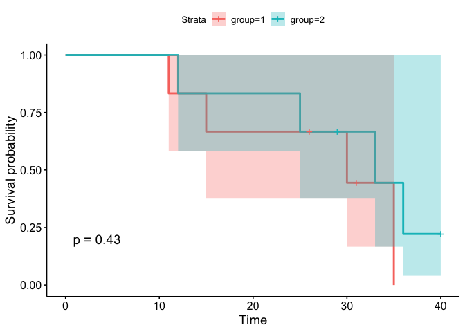
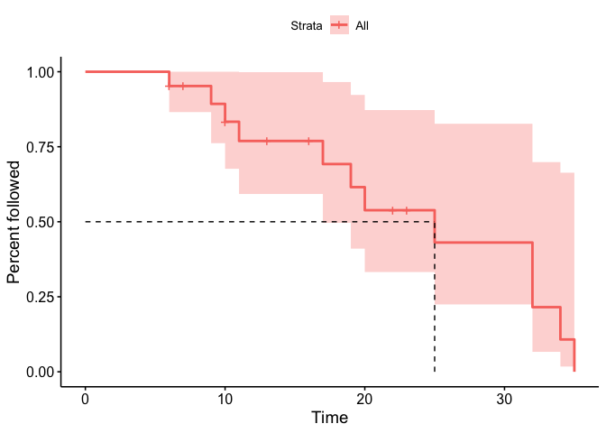
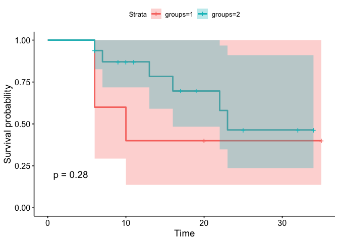

    library(haven)
    library(survival)
    library(survminer)

    ## Loading required package: ggplot2

    ## Loading required package: ggpubr

    ## 
    ## Attaching package: 'survminer'

    ## The following object is masked from 'package:survival':
    ## 
    ##     myeloma

    df <- read_sav("Day 2_Logrank_example.sav")

    head(df)

    ## # A tibble: 6 × 3
    ##    time status group
    ##   <dbl>  <dbl> <dbl>
    ## 1    11      1     1
    ## 2    15      1     1
    ## 3    26      0     1
    ## 4    30      1     1
    ## 5    31      0     1
    ## 6    35      1     1

    fit.KM <- survfit(Surv(time, status) ~ group, data = df)

    summary(fit.KM)

    ## Call: survfit(formula = Surv(time, status) ~ group, data = df)
    ## 
    ##                 group=1 
    ##  time n.risk n.event survival std.err lower 95% CI upper 95% CI
    ##    11      6       1    0.833   0.152        0.583            1
    ##    15      5       1    0.667   0.192        0.379            1
    ##    30      3       1    0.444   0.222        0.167            1
    ##    35      1       1    0.000     NaN           NA           NA
    ## 
    ##                 group=2 
    ##  time n.risk n.event survival std.err lower 95% CI upper 95% CI
    ##    12      6       1    0.833   0.152       0.5827            1
    ##    25      5       1    0.667   0.192       0.3786            1
    ##    33      3       1    0.444   0.222       0.1668            1
    ##    36      2       1    0.222   0.192       0.0407            1

    survdiff(Surv(time, status) ~ group, data = df)

    ## Call:
    ## survdiff(formula = Surv(time, status) ~ group, data = df)
    ## 
    ##         N Observed Expected (O-E)^2/E (O-E)^2/V
    ## group=1 6        4     2.98     0.347     0.626
    ## group=2 6        4     5.02     0.206     0.626
    ## 
    ##  Chisq= 0.6  on 1 degrees of freedom, p= 0.4

    ggsurvplot(fit.KM, conf.int = T, pval = T)

### Minimum, maximum and median follow-up

    df2 <- read_sav("Day 2_drug6mp.sav")

finding the median follow-up

    df2$followup <- 1 - df2$Status

    fit.KM2 <- survfit(Surv(timerelmp, followup) ~ 1, data = df2)
    fit.KM2

    ## Call: survfit(formula = Surv(timerelmp, followup) ~ 1, data = df2)
    ## 
    ##       n events median 0.95LCL 0.95UCL
    ## [1,] 21     12     25      17      NA

    ggsurvplot(fit = fit.KM2, surv.median.line = "hv", ylab ="Percent followed")

and for survival analyses with two groups:

    fit.KM3 <- survfit(Surv(timerelmp, Status) ~ groups, data = df2)
    fit.KM3

    ## Call: survfit(formula = Surv(timerelmp, Status) ~ groups, data = df2)
    ## 
    ##           n events median 0.95LCL 0.95UCL
    ## groups=1  5      3     10       6      NA
    ## groups=2 16      6     23      16      NA

    summary(fit.KM3)

    ## Call: survfit(formula = Surv(timerelmp, Status) ~ groups, data = df2)
    ## 
    ##                 groups=1 
    ##  time n.risk n.event survival std.err lower 95% CI upper 95% CI
    ##     6      5       2      0.6   0.219        0.293            1
    ##    10      3       1      0.4   0.219        0.137            1
    ## 
    ##                 groups=2 
    ##  time n.risk n.event survival std.err lower 95% CI upper 95% CI
    ##     6     16       1    0.938  0.0605        0.826        1.000
    ##     7     14       1    0.871  0.0856        0.718        1.000
    ##    13     10       1    0.783  0.1129        0.591        1.000
    ##    16      9       1    0.696  0.1297        0.484        1.000
    ##    22      6       1    0.580  0.1513        0.348        0.968
    ##    23      5       1    0.464  0.1595        0.237        0.910

    ggsurvplot(fit = fit.KM3, pval = T, conf.int = T)

