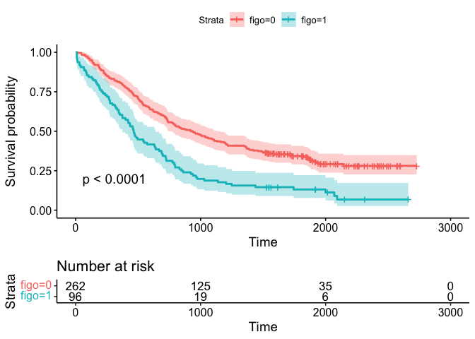
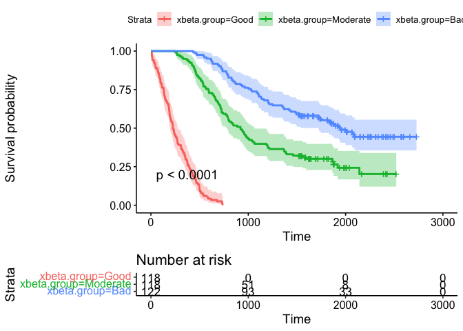

### Larynx carcinoma patients

1.  Yes, until approximately the second year probability of survival is
    higher for the patients with the secondary tumor, then crosses the
    other line. This is about the starting point of the study as it is
    probably taken from the detection of the first tumor.

2.  Either the starting point should be changed to the second year or
    the time of occurrence of the second tumor should be accounted in
    the model.

### Ovarian cancer data

    # install.packages("haven")
    # install.packages("survival")

    library(haven)
    library(survival)
    library(survminer)

#### a.

    df <- read_sav("Day 3_OVA.SAV")

    # KM plot by FIGO
    fit.KM <- survfit(Surv(time, death) ~ figo, data = df)

    fit.KM

    ## Call: survfit(formula = Surv(time, death) ~ figo, data = df)
    ## 
    ##          n events median 0.95LCL 0.95UCL
    ## figo=0 262    180    929     769    1131
    ## figo=1  96     86    464     375     641

    survdiff(Surv(time, death) ~ figo, data = df)

    ## Call:
    ## survdiff(formula = Surv(time, death) ~ figo, data = df)
    ## 
    ##          N Observed Expected (O-E)^2/E (O-E)^2/V
    ## figo=0 262      180    214.8      5.64      29.7
    ## figo=1  96       86     51.2     23.69      29.7
    ## 
    ##  Chisq= 29.7  on 1 degrees of freedom, p= 5e-08

    ggsurvplot(fit.KM, pval = T, conf.int = T, risk.table = T)

    ggsurvplot(fit.KM, pval = T, conf.int = T, fun = "cumhaz")

#### b.

    fit.cox <- coxph(Surv(time, death) ~ as.numeric(figo), data = df)
    fit.cox

    ## Call:
    ## coxph(formula = Surv(time, death) ~ as.numeric(figo), data = df)
    ## 
    ##                    coef exp(coef) se(coef)     z        p
    ## as.numeric(figo) 0.7063    2.0265   0.1322 5.342 9.21e-08
    ## 
    ## Likelihood ratio test=25.97  on 1 df, p=3.464e-07
    ## n= 358, number of events= 266

    summary(fit.cox)

    ## Call:
    ## coxph(formula = Surv(time, death) ~ as.numeric(figo), data = df)
    ## 
    ##   n= 358, number of events= 266 
    ## 
    ##                    coef exp(coef) se(coef)     z Pr(>|z|)    
    ## as.numeric(figo) 0.7063    2.0265   0.1322 5.342 9.21e-08 ***
    ## ---
    ## Signif. codes:  0 '***' 0.001 '**' 0.01 '*' 0.05 '.' 0.1 ' ' 1
    ## 
    ##                  exp(coef) exp(-coef) lower .95 upper .95
    ## as.numeric(figo)     2.026     0.4935     1.564     2.626
    ## 
    ## Concordance= 0.573  (se = 0.014 )
    ## Likelihood ratio test= 25.97  on 1 df,   p=3e-07
    ## Wald test            = 28.53  on 1 df,   p=9e-08
    ## Score (logrank) test = 29.7  on 1 df,   p=5e-08

lower CI

    exp(0.7063 - 1.96 * 0.1322)

    ## [1] 1.563908

upper CI

    exp(0.7063 + 1.96 * 0.1322)

    ## [1] 2.625869

#### d.

    fit.cox2 <- coxph(Surv(time, death) ~ as.factor(figo), data = df)
    fit.cox2

    ## Call:
    ## coxph(formula = Surv(time, death) ~ as.factor(figo), data = df)
    ## 
    ##                    coef exp(coef) se(coef)     z        p
    ## as.factor(figo)1 0.7063    2.0265   0.1322 5.342 9.21e-08
    ## 
    ## Likelihood ratio test=25.97  on 1 df, p=3.464e-07
    ## n= 358, number of events= 266

#### e.

#### f.

    fit.cox3 <- coxph(Surv(time, death) ~ as.factor(karn), data = df)
    fit.cox3

    ## Call:
    ## coxph(formula = Surv(time, death) ~ as.factor(karn), data = df)
    ## 
    ##                      coef exp(coef) se(coef)      z        p
    ## as.factor(karn)7  -0.3576    0.6994   0.2782 -1.285   0.1987
    ## as.factor(karn)8  -0.8548    0.4254   0.2849 -3.000   0.0027
    ## as.factor(karn)9  -1.0985    0.3334   0.2589 -4.242 2.21e-05
    ## as.factor(karn)10 -1.1689    0.3107   0.2533 -4.615 3.92e-06
    ## 
    ## Likelihood ratio test=31.17  on 4 df, p=2.832e-06
    ## n= 358, number of events= 266

    summary(fit.cox3)

    ## Call:
    ## coxph(formula = Surv(time, death) ~ as.factor(karn), data = df)
    ## 
    ##   n= 358, number of events= 266 
    ## 
    ##                      coef exp(coef) se(coef)      z Pr(>|z|)    
    ## as.factor(karn)7  -0.3576    0.6994   0.2782 -1.285   0.1987    
    ## as.factor(karn)8  -0.8548    0.4254   0.2849 -3.000   0.0027 ** 
    ## as.factor(karn)9  -1.0985    0.3334   0.2589 -4.242 2.21e-05 ***
    ## as.factor(karn)10 -1.1689    0.3107   0.2533 -4.615 3.92e-06 ***
    ## ---
    ## Signif. codes:  0 '***' 0.001 '**' 0.01 '*' 0.05 '.' 0.1 ' ' 1
    ## 
    ##                   exp(coef) exp(-coef) lower .95 upper .95
    ## as.factor(karn)7     0.6994      1.430    0.4054    1.2065
    ## as.factor(karn)8     0.4254      2.351    0.2434    0.7435
    ## as.factor(karn)9     0.3334      3.000    0.2007    0.5538
    ## as.factor(karn)10    0.3107      3.218    0.1891    0.5104
    ## 
    ## Concordance= 0.597  (se = 0.017 )
    ## Likelihood ratio test= 31.17  on 4 df,   p=3e-06
    ## Wald test            = 36.5  on 4 df,   p=2e-07
    ## Score (logrank) test = 39.13  on 4 df,   p=7e-08

#### g.

    fit.cox5 <- coxph(Surv(time, death) ~ figo + karn + diam, data = df)
    fit.cox5

    ## Call:
    ## coxph(formula = Surv(time, death) ~ figo + karn + diam, data = df)
    ## 
    ##          coef exp(coef) se(coef)      z       p
    ## figo  0.54183   1.71915  0.13529  4.005 6.2e-05
    ## karn -0.17173   0.84221  0.05319 -3.228 0.00125
    ## diam  0.20018   1.22162  0.04947  4.047 5.2e-05
    ## 
    ## Likelihood ratio test=64.15  on 3 df, p=7.64e-14
    ## n= 358, number of events= 266

    summary(fit.cox5)

    ## Call:
    ## coxph(formula = Surv(time, death) ~ figo + karn + diam, data = df)
    ## 
    ##   n= 358, number of events= 266 
    ## 
    ##          coef exp(coef) se(coef)      z Pr(>|z|)    
    ## figo  0.54183   1.71915  0.13529  4.005  6.2e-05 ***
    ## karn -0.17173   0.84221  0.05319 -3.228  0.00125 ** 
    ## diam  0.20018   1.22162  0.04947  4.047  5.2e-05 ***
    ## ---
    ## Signif. codes:  0 '***' 0.001 '**' 0.01 '*' 0.05 '.' 0.1 ' ' 1
    ## 
    ##      exp(coef) exp(-coef) lower .95 upper .95
    ## figo    1.7192     0.5817    1.3187    2.2412
    ## karn    0.8422     1.1874    0.7588    0.9348
    ## diam    1.2216     0.8186    1.1087    1.3460
    ## 
    ## Concordance= 0.66  (se = 0.016 )
    ## Likelihood ratio test= 64.15  on 3 df,   p=8e-14
    ## Wald test            = 66.32  on 3 df,   p=3e-14
    ## Score (logrank) test = 69.1  on 3 df,   p=7e-15

    fit.cox6 <- coxph(Surv(time, death) ~ figo * karn * diam , data = df)

    fit.cox6

    ## Call:
    ## coxph(formula = Surv(time, death) ~ figo * karn * diam, data = df)
    ## 
    ##                      coef  exp(coef)   se(coef)      z      p
    ## figo              7.42514 1677.63351    2.93914  2.526 0.0115
    ## karn             -0.12065    0.88635    0.19268 -0.626 0.5312
    ## diam              0.27584    1.31764    0.51612  0.534 0.5930
    ## figo:karn        -0.75430    0.47034    0.33268 -2.267 0.0234
    ## figo:diam        -1.77815    0.16895    0.83950 -2.118 0.0342
    ## karn:diam        -0.00508    0.99493    0.05573 -0.091 0.9274
    ## figo:karn:diam    0.19453    1.21474    0.09637  2.019 0.0435
    ## 
    ## Likelihood ratio test=71.57  on 7 df, p=7.107e-13
    ## n= 358, number of events= 266

#### i and j

Take the best model:

    xBeta <- predict(fit.cox5, type = "expected")

    values <- quantile(xBeta, c(.33, .66, 1))
    values <- c(0, values)

    df$xbeta.group <- cut(xBeta, values, labels = c("Good", "Moderate", "Bad"))

    fit.KM.xbeta <- survfit(Surv(time, death) ~ xbeta.group, data = df)

    ggsurvplot(fit.KM.xbeta, pval = T, conf.int = T, risk.table = T)

\#\#\#\# k.

    predict(fit.cox5, type = c("survival"))

    ##          1          2          3          4          5          6          7 
    ## 0.75009912 0.51269643 0.51269643 0.51269643 0.56143110 0.53559013 0.54696557 
    ##          8          9         10         11         12         13         14 
    ## 0.67665450 0.57813781 0.59206236 0.78296576 0.60308609 0.58894764 0.75765300 
    ##         15         16         17         18         19         20         21 
    ## 0.59206236 0.59497656 0.59497656 0.44213994 0.55903760 0.58106865 0.44213994 
    ##         22         23         24         25         26         27         28 
    ## 0.65058036 0.84425177 0.93403796 0.58377129 0.57019077 0.46637647 0.47274927 
    ##         29         30         31         32         33         34         35 
    ## 0.47274927 0.71030167 0.92166597 0.49401000 0.60764228 0.51202710 0.51202710 
    ##         36         37         38         39         40         41         42 
    ## 0.84757351 0.52374664 0.54772681 0.52713238 0.61023135 0.53030373 0.53334743 
    ##         43         44         45         46         47         48         49 
    ## 0.45237815 0.92163310 0.50387905 0.50847325 0.53333460 0.53333460 0.53668531 
    ##         50         51         52         53         54         55         56 
    ## 0.77668323 0.37944964 0.37944964 0.53067584 0.37944964 0.59485693 0.37944964 
    ##         57         58         59         60         61         62         63 
    ## 0.43769488 0.79542699 0.42260618 0.83687822 0.57302016 0.90768735 0.41083917 
    ##         64         65         66         67         68         69         70 
    ## 0.77516233 0.63164027 0.46397828 0.79042760 0.46397828 0.60559318 0.46397828 
    ##         71         72         73         74         75         76         77 
    ## 0.47409418 0.83642872 0.74949122 0.88837093 0.82485898 0.48235105 0.36898521 
    ##         78         79         80         81         82         83         84 
    ## 0.39384224 0.60496244 0.71684136 0.58052012 0.76424370 0.85164341 0.77471730 
    ##         85         86         87         88         89         90         91 
    ## 0.74095260 0.45380900 0.48538298 0.45380900 0.73005983 0.55121142 0.34183956 
    ##         92         93         94         95         96         97         98 
    ## 0.72433168 0.30611640 0.84789725 0.30611640 0.93566314 0.34916928 0.72906885 
    ##         99        100        101        102        103        104        105 
    ## 0.38304581 0.71721442 0.87713017 0.94153484 0.88328717 0.38723582 0.39136961 
    ##        106        107        108        109        110        111        112 
    ## 0.31645154 0.38455449 0.38455449 0.77662623 0.45277007 0.25422107 0.31639584 
    ##        113        114        115        116        117        118        119 
    ## 0.39011326 0.33605969 0.29583517 0.67088625 0.29583517 0.77901278 0.58927063 
    ##        120        121        122        123        124        125        126 
    ## 0.87592344 0.94891074 0.56701575 0.68587943 0.85790577 0.72607338 0.67589067 
    ##        127        128        129        130        131        132        133 
    ## 0.38091632 0.38091632 0.49965555 0.39456774 0.38805511 0.31115484 0.32001571 
    ##        134        135        136        137        138        139        140 
    ## 0.33872218 0.64516302 0.90494356 0.42148648 0.41053372 0.37270435 0.64185341 
    ##        141        142        143        144        145        146        147 
    ## 0.23547736 0.26513177 0.35366350 0.29617279 0.77561052 0.44814053 0.28171410 
    ##        148        149        150        151        152        153        154 
    ## 0.28662539 0.57743437 0.52464885 0.19473653 0.76164696 0.26354406 0.98636499 
    ##        155        156        157        158        159        160        161 
    ## 0.93060143 0.34238133 0.30348495 0.22585216 0.22585216 0.65577759 0.34957665 
    ##        162        163        164        165        166        167        168 
    ## 0.91374650 0.71313916 0.74762221 0.47854707 0.84558805 0.70774967 0.81014979 
    ##        169        170        171        172        173        174        175 
    ## 0.22585216 0.22585216 0.22585216 0.93794649 0.33057591 0.59142038 0.38118356 
    ##        176        177        178        179        180        181        182 
    ## 0.68871618 0.49083670 0.89538345 0.44101575 0.35276535 0.25516639 0.86557160 
    ##        183        184        185        186        187        188        189 
    ## 0.75289102 0.87306843 0.56254910 0.30756247 0.31119681 0.45983678 0.31791835 
    ##        190        191        192        193        194        195        196 
    ## 0.17958980 0.17958980 0.53933428 0.18710505 0.49939214 0.24860378 0.77282495 
    ##        197        198        199        200        201        202        203 
    ## 0.43670764 0.45569525 0.23176737 0.81511897 0.17090745 0.32447798 0.20279965 
    ##        204        205        206        207        208        209        210 
    ## 0.50041317 0.45178837 0.76121070 0.17090745 0.88132985 0.46121761 0.30257575 
    ##        211        212        213        214        215        216        217 
    ## 0.89843424 0.52053434 0.19755580 0.78758252 0.20799273 0.22616707 0.71982471 
    ##        218        219        220        221        222        223        224 
    ## 0.23481241 0.93382048 0.77589247 0.54830166 0.60292635 0.80646898 0.79631404 
    ##        225        226        227        228        229        230        231 
    ## 0.61497135 0.25333338 0.96452111 0.73365220 0.72037298 0.75681318 0.32232365 
    ##        232        233        234        235        236        237        238 
    ## 0.66081568 0.38673790 0.19027550 0.69217643 0.50519001 0.18901773 0.89500473 
    ##        239        240        241        242        243        244        245 
    ## 0.86434501 0.14282443 0.91112347 0.92884564 0.56737079 0.63570890 0.87563300 
    ##        246        247        248        249        250        251        252 
    ## 0.92686915 0.27187064 0.26884752 0.90371498 0.12274848 0.36024000 0.93839516 
    ##        253        254        255        256        257        258        259 
    ## 0.63402567 0.47362581 0.14079442 0.70333756 0.84910609 0.84412227 0.42326104 
    ##        260        261        262        263        264        265        266 
    ## 0.70665542 0.71725682 0.13066569 0.70424222 0.47781916 0.30114403 0.32944609 
    ##        267        268        269        270        271        272        273 
    ## 0.63639931 0.27866394 0.47972239 0.08285909 0.93497296 0.34720005 0.48315044 
    ##        274        275        276        277        278        279        280 
    ## 0.44547543 0.65477356 0.93881664 0.65339624 0.84265335 0.88386072 0.54112783 
    ##        281        282        283        284        285        286        287 
    ## 0.30056542 0.59918310 0.27854907 0.51592033 0.23881854 0.25687707 0.95919395 
    ##        288        289        290        291        292        293        294 
    ## 0.18013720 0.77222958 0.28477760 0.94585081 0.37596597 0.15445042 0.08843504 
    ##        295        296        297        298        299        300        301 
    ## 0.36912025 0.94659765 0.94276046 0.99243266 0.08323116 0.76681049 0.84287933 
    ##        302        303        304        305        306        307        308 
    ## 0.11327604 0.35325849 0.65708090 0.60587062 0.34909756 0.47089856 0.22509197 
    ##        309        310        311        312        313        314        315 
    ## 0.26128819 0.38701523 0.77129837 0.79359505 0.75358264 0.29607517 0.09640664 
    ##        316        317        318        319        320        321        322 
    ## 0.40609598 0.99264414 0.72866960 0.91890389 0.25113564 0.44472781 0.50689470 
    ##        323        324        325        326        327        328        329 
    ## 0.06680658 0.88568698 0.15980306 0.97263176 0.05905859 0.97125751 0.57423242 
    ##        330        331        332        333        334        335        336 
    ## 0.43980444 0.79985794 0.75340510 0.64336193 0.59995075 0.27939544 0.52105171 
    ##        337        338        339        340        341        342        343 
    ## 0.93537949 0.75668689 0.13847683 0.01828349 0.27249656 0.22993019 0.34980110 
    ##        344        345        346        347        348        349        350 
    ## 0.55559078 0.02224190 0.60929661 0.05117068 0.95788423 0.84994231 0.31096891 
    ##        351        352        353        354        355        356        357 
    ## 0.13276533 0.53849550 0.98458658 0.34406412 0.81404939 0.96928203 0.78572289 
    ##        358 
    ## 0.94338491
